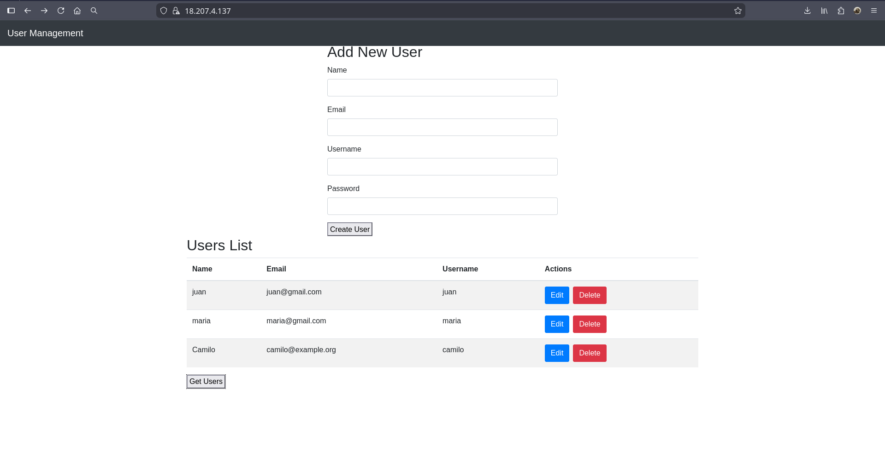
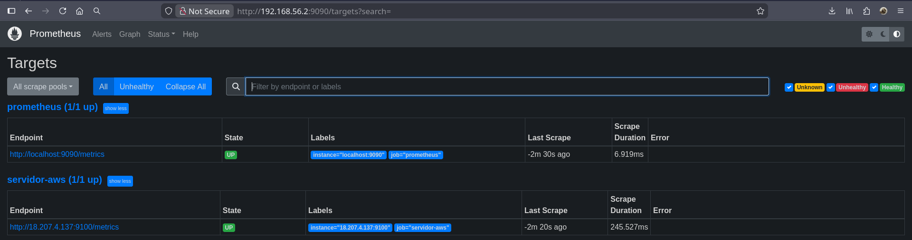
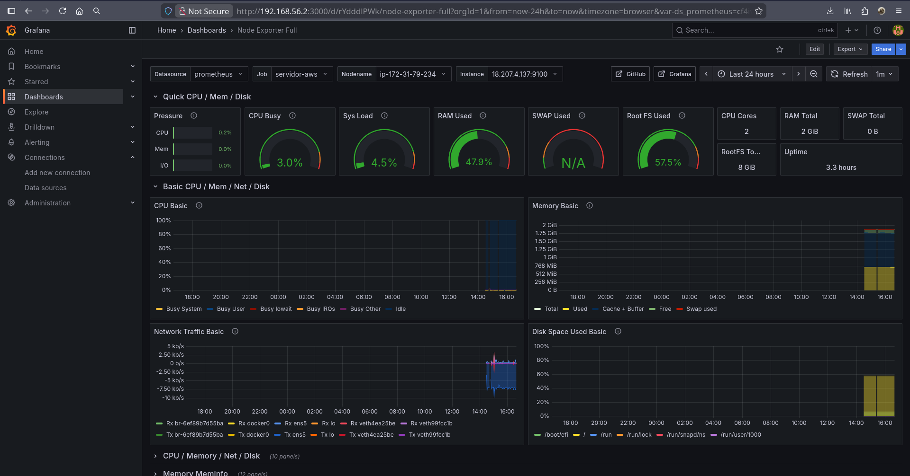

# Examen final
### Servicios Telemáticos

Este proyecto consiste en el despliegue seguro y monitoreo de una aplicación web en la nube para la empresa ficticia CloudNova.

### Instalación de Docker & Node Exporter

Vagrant va a automáticamente instalar Docker y Node Exporter en la máquina virtual 2; en caso de querer utilizar el script fuera de Vagrant, por ejemplo en un servidor de Amazon Web Services, es necesario realizar unos pasos extra:

- Se debe permitir el acceso al puerto 9100 desde la página de Amazon Web Services.
- Se debe mover manualmente el archivo `node_exporter.service` a su zona correspondiente.

```
$ sudo cp node_exporter.service /etc/systemd/system/
$ sudo bash scriptServidor2.sh
```

### Despliegue con Docker

- Se clonó el repositorio [MiniWebApp](https://github.com/omondragon/MiniWebApp) de GitHub _(**Nota:** su máquina virtual solo es necesaria para construir las imágenes de Docker en ella, se puede ignorar y usar la máquina virtual 2 de este repositorio para hacer depliegues con Docker Compose)_.
- Se configuró Apache para servir la aplicación de Flask mediante HTTPS, utilizando un certificado SSL auto-firmado.
- Se implementó una redirección automática de HTTP a HTTPS.
- Se creó con Docker una imagen propia que contiene los servicios anteriormente mencionados.
- Se creó un archivo docker-compose.yml para orquestar la aplicación de la imagen creada anteriormente con un contenedor MySQL.
- Se accedió a la aplicación localmente para verificar su funcionamiento.
- Se desplegó de la misma forma pero desde el servidor público de Amazon Web Services.

Para utilizar este proyecto, recuerde crear las carpetas y mover los archivos correspondientes dentro de la carpeta del archivo Docker Compose para que funcione correctamente. 

```
$ mkdir -p docker_compose/db
$ mkdir -p docker_compose/ssl_private
$ mkdir -p docker_compose/ssl_certs

$ sudo cp init.sql docker_compose/db/
$ sudo cp /etc/ssl/private/apache-selfsigned.key docker_compose/ssl_private/
$ sudo cp /etc/ssl/certs/apache-selfsigned.crt docker_compose/ssl_certs/

$ docker compose up -d
```

Además, si vas a construir manualmente la imagen de Apache, recuerde reemplazar los archivos del repositorio de MiniWebApp con los que se encuentren en este proyecto para que funcione correctamente.

### Instalación de Prometheus & Grafana

Vagrant va a automáticamente instalar Prometheus y Grafana en la máquina virtual 1; lo único que hay que configurar manualmente es el archivo `/etc/prometheus/prometheus.yml` y luego de ello reiniciar el servicio de Prometheus.

```
$ sudo systemctl restart prometheus
```

Por último, queda personalizar tanto Prometheus como Grafana; para ello se puede hacer manualmente, o aprovechar el archivo de configuración `grafana-imported-dashboard.json` para obtener un dashboard completo de forma sencilla.

### Imágenes






